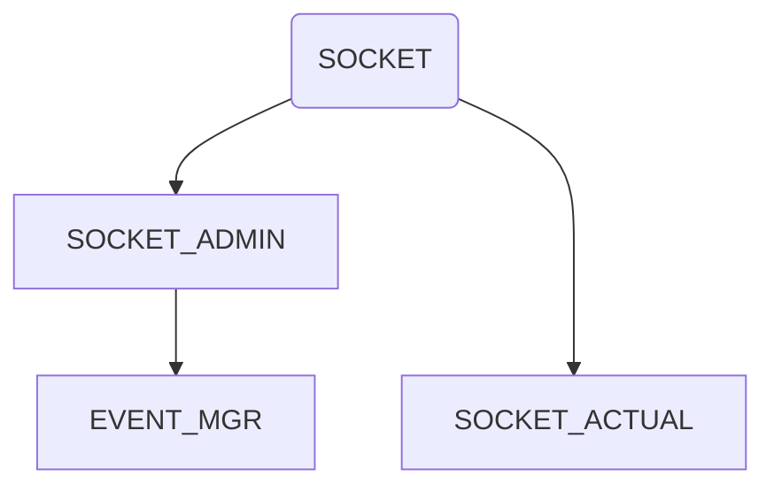

<!-- - [ ] approval collision
    - [ ] number of casualty
    - slider
- [ ] approval visibility
    - [ ] grant visibility status
    - button
    - [ ] grant visibility type
    - button -->
- [x] bomb casualty numbers
    - slider
- [ ] PENDING ID for paused movements
---
- [x] Admin panel (events validation)
    - [x] Map to admin socket
    - [ ] Admin to DB
- [x] Timer / Table /  Announcements
    - [x] Team / DEFCON / Amount of Objectives
    - [x] Socket connections
    - [ ] Database source > connection
---

---
