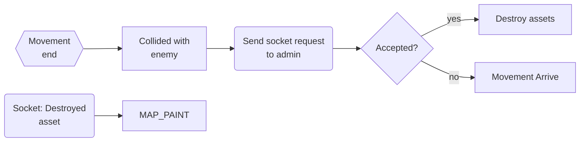
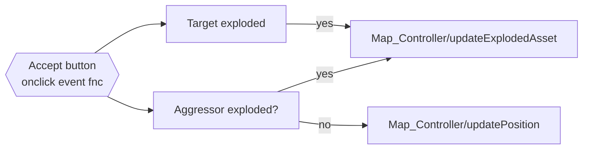

<!-- - [ ] approval collision
    - [ ] number of casualty
    - slider
- [ ] approval visibility
    - [ ] grant visibility status
    - button
    - [ ] grant visibility type
    - button -->
**Map Logic**
- [ ] Map should draw attackId instead of assetId
- [ ] Visibility logic for radar(drones)
- [ ] Persistent assets for bases (delete)
- [ ] hardcoded speed
- [ ] Base tooltip data: children

---
**Database writes**

- [ ] Movement done
    - [x] functions done
    - [ ] database confirmation

- [ ] Explosion
    - [x] functions done
    - [ ] database confirmation 
- [x] bomb casualty numbers
    - slider
- [ ] PENDING ID for paused movements
---
- [x] Admin panel (events validation)
    - [x] Map to admin socket
    - [ ] Admin to DB
- [x] Timer / Table /  Announcements
    - [x] Team / DEFCON / Amount of Objectives
    - [x] Socket connections
    - [x] Database source > connection

---
**Colllision algo**
- Load database assets
- forEach asset
    - Compute trajectories
    - Determine if moving or not
- 
---
**base**
- [x] Determine if base is population or military base
- [x] Add record for children
- [ ] Tooltip
- [ ] Visibility
- [ ] Base attack
- [ ] attack id

---